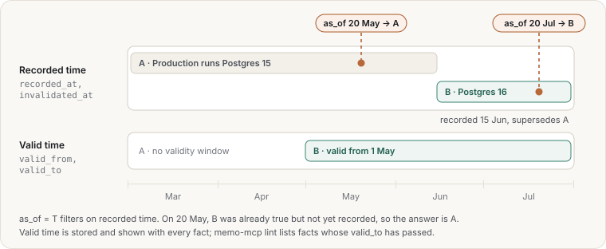

# Facts and time

A **fact** is one sentence with an optional subject list, an evidence passage and a validity
window. Facts are searched by their own arm. A matching fact votes for its evidence passage.

```bash
memors-mcp remember "Production runs Postgres 16" --about postgres,production \
  --evidence memo://chunk/812 --valid-from 2026-06-01
memors-mcp facts ls --ns default
memors-mcp facts ls --as-of 2026-05-15 --history
```

## Correcting facts

- **Supersede**: `remember "<new>" --supersedes memo://fact/<old>`. The old fact is invalidated,
  not deleted, and remains visible under `as_of` and `--history`. Agents may supersede only
  `agent`-trust facts.
- **Expire**: set `--valid-to`. `memors-mcp lint` lists facts past their window.
- **Retire**: `memors-mcp forget memo://fact/<id> --reason "…"`.

## Two clocks

| Clock | Columns | Question it answers |
|---|---|---|
| Recorded time | `recorded_at`, `invalidated_at` | When did the knowledge base learn or drop this? |
| Valid time | `valid_from`, `valid_to` | When is this true in the world? |

`as_of=T`, available on the `search` and `explore` tools and on `facts ls --as-of` and
`explore --as-of` in the CLI, shows what was recorded on or before T and not superseded before
T. Valid time does not filter: it is stored and shown with each fact, and `memors-mcp lint` lists
facts whose `valid_to` has passed.



## Conflicts

Two live facts about the same subject, with overlapping windows and differing statements, form
a **conflict**. `compact` turns each conflict into a work item, together with the rule the
server would apply: higher trust wins, then the newer fact. A human or agent settles it with
`submit <item> --keep memo://fact/<id>`. When conflicting facts both match a search and score
within 10% of each other, trust breaks the tie.
