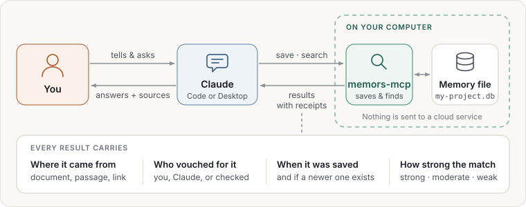

# Welcome

**memors-mcp gives your AI assistant a memory it can show its work from.**

You tell Claude something once: how your team deploys, why a decision was made, which version
of a library you use. Claude saves it. Next week, in a new conversation, Claude finds it again
and tells you exactly where the answer came from, who wrote it down, and when.

Everything lives in one file on your own computer. Nothing is sent to a cloud service.

## Who this is for

- **People who work with Claude every day** and are tired of explaining the same background in
  every new conversation.
- **Teams and project leads** who want decisions, conventions and hard-won answers to stay
  findable, with a clear record of where each one came from.
- **Anyone who cares where an answer came from.** Every result carries its source, and you can
  ask why it was chosen.

## What it is not

- It is not a chat app. You keep using Claude as usual; memors-mcp works in the background.
- It is not a cloud service. There is no account, no subscription and no upload.
- It does not browse the web. Claude finds information and hands it over to be saved.
- It does not decide what is true on your behalf. Notes Claude writes are marked as Claude's
  until you say otherwise.

## How to read this guide

| If you want to… | Read |
|---|---|
| Decide whether it is worth it | [Why it matters](why.md) |
| Get it running | [Quick start](quick-start.md), about ten minutes |
| Learn what to say to Claude | [Everyday use](everyday/README.md) |
| Understand what you can rely on | [Trust](trust.md) and [Privacy and safety](privacy.md) |
| See it in a browser | [Looking inside](looking-inside.md) |
| Get ideas | [Use cases](use-cases.md) |
| Fix a problem | [Questions and troubleshooting](faq.md) |

> **Running it for others, or want the technical details?** The
> [operator guide](../operator/) covers installation options, every setting, tuning and
> monitoring.
