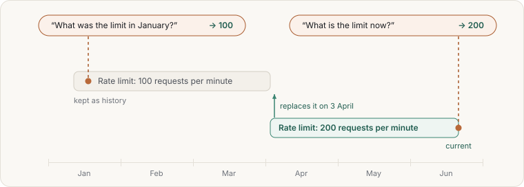

# Facts and corrections

A **fact** is one short statement worth keeping on its own:

- "The API rate limit is 100 requests per minute."
- "Alice owns the billing service."
- "We use Postgres 16 in production."

Facts are separate from documents because they are small, they change, and you often want the
current one.

## Recording a fact

> Remember that the API rate limit is 100 requests per minute.

A good fact points to its proof. When Claude learns a fact from a saved document, it links the
fact to the passage that says so. The fact then carries its own source.

You can also say how long a fact holds:

> Remember that the office is closed from 23 December to 2 January.

## Correcting a fact

When something changes, say so:

> The rate limit is now 200 per minute. Update memors.

Claude records the new fact as replacing the old one. The new fact is current from now on. The
old one is not deleted; it is kept as history with the date it stopped being true.

## Looking back

> What was the rate limit in January?

> Show me the history of the rate limit fact.

The browser view has a **facts timeline** that shows the same thing at a glance. See
[Looking inside](../looking-inside.md).

## When facts disagree

Two facts can contradict each other, for example when two people recorded different numbers.
memors-mcp notices this and lists it as something to resolve. See
[Keeping it tidy](../keeping-tidy.md).
