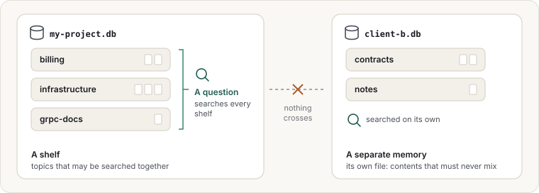

# Keeping work separate

memors-mcp gives you two ways to keep things apart: **shelves** inside one memory, and
**separate memories**.



## Shelves: topics within one memory

A shelf is a label for a group of documents, such as `billing`, `infrastructure` or
`grpc-docs`. Questions search every shelf unless you say otherwise, so shelves organise
without hiding anything.

> Save this on the billing shelf.

> Only look on the infrastructure shelf.

Use shelves for topics within one project or team.

## Separate memories: one per project or client

Each memory is its own file. Nothing in one can be found from another. Use separate memories
when the contents must not mix, for example for different clients, or for work and personal
notes.

The memory's name is set when you connect memors-mcp to Claude. It is the `MEMORS_KB` value in
[Quick start](../quick-start.md), step 2. To add a second memory, add memors-mcp again under
another name:

```bash
claude mcp add memors-client-b --env MEMORS_KB=client-b -- ~/bin/memors-mcp
```

In Claude Code, you can also set a memory per project folder, so each project automatically
gets its own. The [operator guide](../../operator/) shows how.

| Use… | When |
|---|---|
| A shelf | Topics that may be searched together |
| A separate memory | Contents that must never mix |
