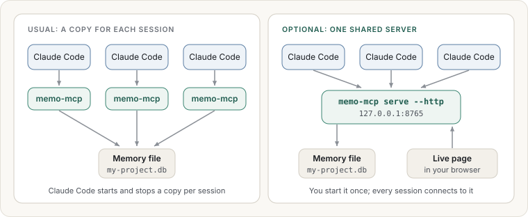

# Quick start

This takes about ten minutes. At the end, Claude will have a memory, and you will have saved
your first note and asked your first question.

## What you need

- A Mac, Linux or Windows computer.
- Claude Code, or the Claude Desktop app.
- About 200 MB of free disk space for the program and its one-time download.

## Step 1: Download memo-mcp

1. Open the [releases page](https://github.com/kKEo/memory-find/releases).
2. Download the file for your computer:

   | Your computer | File name contains |
   |---|---|
   | Mac with Apple silicon (M1 and newer) | `darwin_arm64` |
   | Mac with Intel | `darwin_amd64` |
   | Linux | `linux_amd64` or `linux_arm64` |
   | Windows | `windows_amd64` |

3. Unpack it. Inside is a single program called `memo-mcp` (or `memo-mcp.exe` on Windows).
4. Move it somewhere permanent, for example a `bin` folder in your home folder. Note the full
   path; you need it in the next step.

To check that it runs, open a terminal and type the path to the program followed by `version`:

```bash
~/bin/memo-mcp version
```

You should see a version number. On a Mac, if you see a warning that the developer cannot be
verified, open **System Settings → Privacy & Security** and choose **Allow Anyway**.

## Step 2: Connect it to Claude

Choose a name for this memory. One memory per project works well, for example `my-project`.

### Claude Code

Run this once in a terminal, with your own path and name:

```bash
claude mcp add memo --env MEMO_KB=my-project -- ~/bin/memo-mcp
```

### Claude Desktop

Open **Settings → Developer → Edit Config**, add the `memo` entry below and save. Use the full
path to the program; `~` does not work here.

```json
{
  "mcpServers": {
    "memo": {
      "command": "/Users/you/bin/memo-mcp",
      "env": { "MEMO_KB": "my-project" }
    }
  }
}
```

Then quit Claude Desktop completely and open it again.

### Optional: one shared server for all your Claude Code sessions

With the setup above, every Claude Code session starts its own copy of memo-mcp in the
background. Alternatively, you can run **one** memo-mcp yourself and let every session connect to
it over a local web address. Pick this if you want the **Live** page in the browser view,
which shows which sessions are connected and what they are doing right now.



1. In a terminal, start the server and leave the terminal open:

   ```bash
   MEMO_KB=my-project ~/bin/memo-mcp serve --http 127.0.0.1:8765
   ```

2. Connect Claude Code to it, once:

   ```bash
   claude mcp add --transport http memo http://127.0.0.1:8765/mcp
   ```

   If you already added `memo` with the command above, remove it first with
   `claude mcp remove memo`, or give this one another name.

3. Open `http://127.0.0.1:8765/` in your browser to see your memory, including the **Live**
   page.

On your own computer no password is needed. If you want other computers to connect, you need
a certificate and a token; see "One shared server over HTTP" in the operator guide.

Claude can use the memory only while that terminal is running. If you close it, Claude
reports that memo is not connected; start it again and run `/mcp` in Claude Code to
reconnect. The address works only on your own computer.

## Step 3: Check that Claude sees it

Start a new conversation and ask:

> What is in my memo knowledge base?

Claude should answer that the memory is empty, or list what it holds. In Claude Code, the
`/mcp` command also lists `memo` as connected.

> **The first start downloads a language model.** It is about 140 MB, happens once, and takes
> a minute or two. Until it finishes, searching still works by matching words, and Claude may
> mention that search is "degraded". Notes saved during that time are fully searchable once the
> download completes. This is the only time memo-mcp uses the internet.

## Step 4: Save your first note

Tell Claude something worth keeping, and ask it to save it:

> Save this to memo: we deploy on Tuesdays only, and the release owner runs the smoke tests
> before tagging.

Claude confirms it was saved and gives it an address that starts with `memo://`. That address
is how you and Claude point at this exact note later.

You can also hand over a whole document:

> Read docs/architecture.md and save it to memo as project documentation.

## Step 5: Ask your first question

Start a **new** conversation, so Claude cannot simply remember the last one, and ask:

> When do we release? Check memo.

Claude finds the note, answers, and names the source. To see how it decided, ask:

> Why did that result come first?

## You are set up

- Learn what to say day to day in [Everyday use](everyday/README.md).
- Open the memory in a browser: [Looking inside](looking-inside.md).
- If something did not work, see [Questions and troubleshooting](faq.md).
