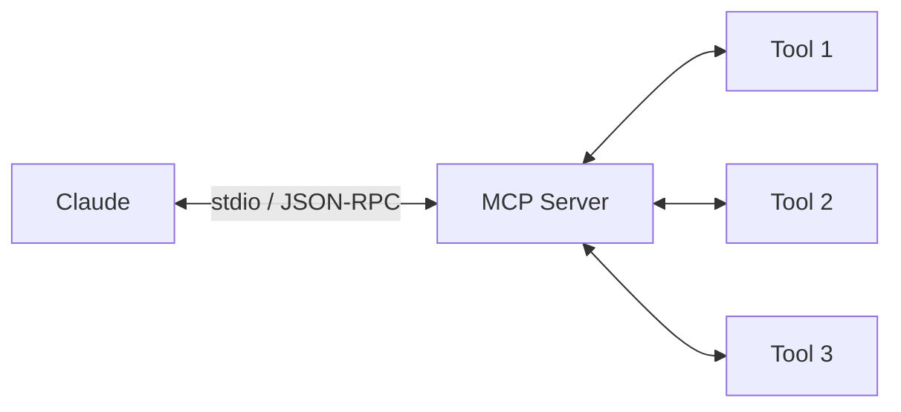
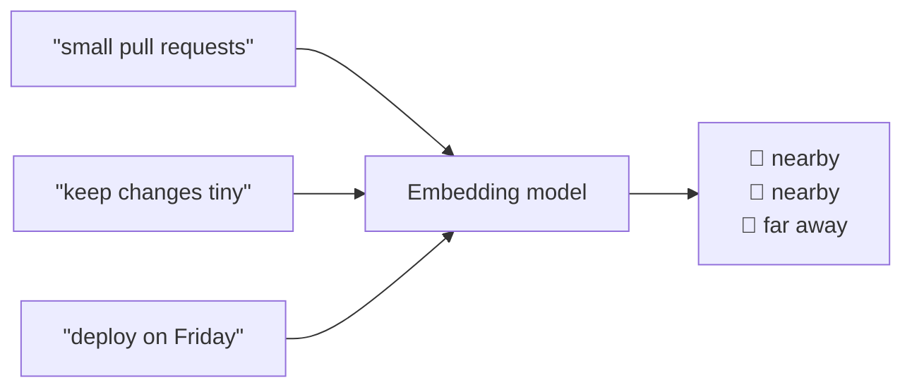
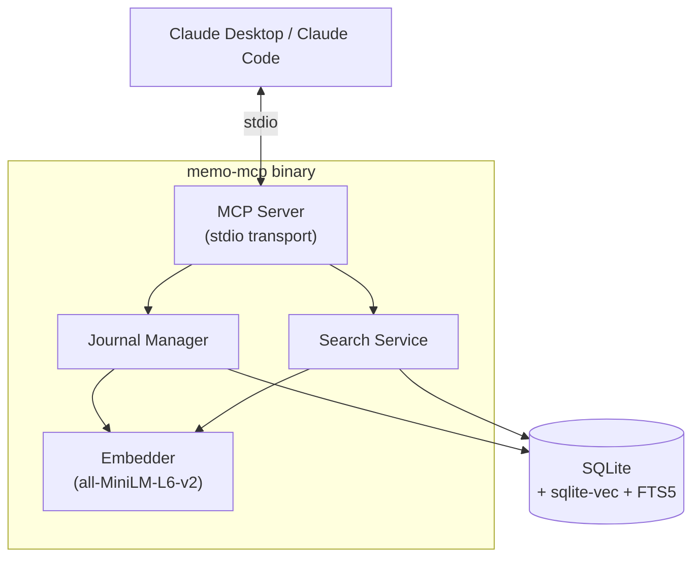
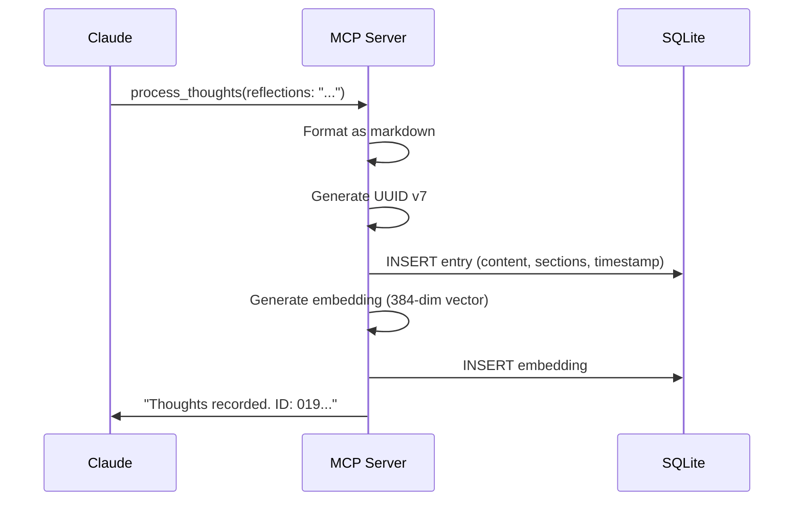
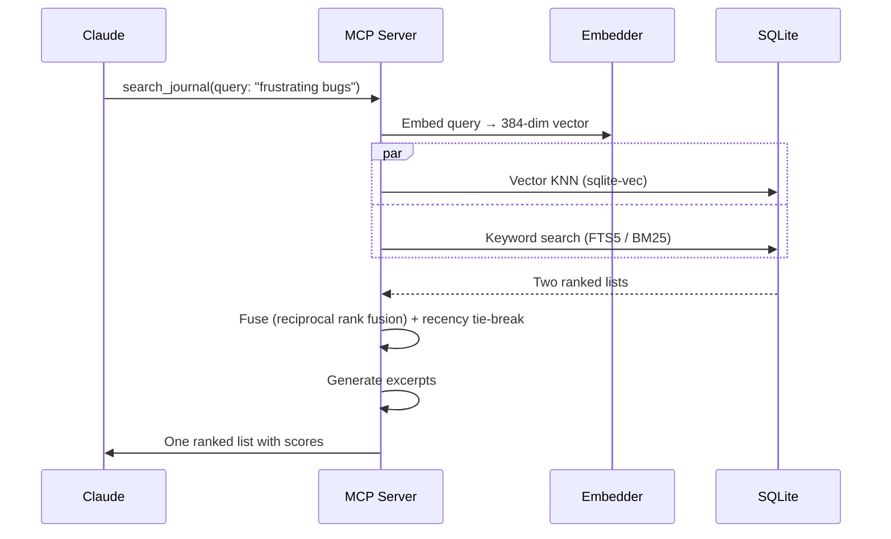
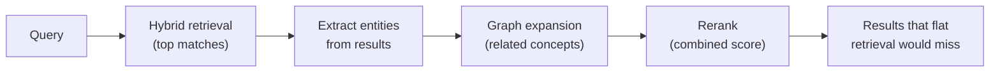
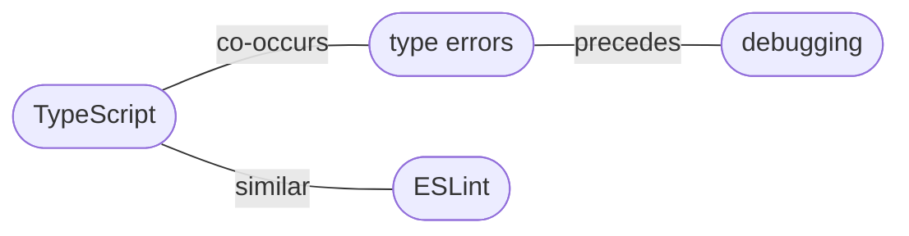

# memo-mcp

## A Private Journal for Claude

Giving AI a memory it can search

<style>
h1 {
  background-color: #2B90B6;
  background-image: linear-gradient(45deg, #4EC5D4 10%, #146b8c 20%);
  background-size: 100%;
  -webkit-background-clip: text;
  -moz-background-clip: text;
  -webkit-text-fill-color: transparent;
  -moz-text-fill-color: transparent;
}
</style>

---

# What We'll Cover

<v-clicks>

**Part 1 · The Essentials**
What memo-mcp is, the ideas behind it (MCP, embeddings, semantic search), and how to set it up.
*No machine-learning background needed.*

**Part 2 · Going Deeper**
Where today's approach hits its limits, and the road toward a graph-powered "second brain".
*For the curious — skip it and you still have the whole story.*

</v-clicks>

---
layout: center
---

# The Problem

<v-clicks>

Claude forgets **everything** between conversations.

Insights, patterns, and context — gone.

What if Claude could keep a **private notebook**?

</v-clicks>

---

# What is MCP?

**Model Context Protocol** — a standard for giving AI tools.



<v-click>

Think of it like **USB for AI** — plug in new capabilities without changing the model.

</v-click>

<v-click>

- Defined by Anthropic, open standard
- Servers expose **tools** that Claude can call
- Communication over stdio (local) or HTTP (remote)

</v-click>

---

# Why Not *Just* Search the Text?

You could `grep` your notes for a word. But memory isn't only about *words* — it's often about *meaning*.

<v-clicks>

| You search for… | Keyword search finds | What you actually want |
|---|---|---|
| `"frustrating bugs"` | only entries with those exact words | "spent all day chasing a race condition" |
| `"PR preferences"` | nothing — you wrote "small pull requests" | the note about keeping changes small |

**Semantic search** matches by meaning, not spelling — but it has the opposite failure
mode: it can blur past an exact error code or identifier that keyword search would
nail instantly. memo-mcp doesn't pick one; it runs **both** and combines the results.
Understanding each half separately is still the fastest way to see why that combination
works, so that's where we start.

</v-clicks>

---

# Embeddings in Plain English

An **embedding** turns a piece of text into a list of numbers — coordinates on a map of meaning.



<v-clicks>

- Text with **similar meaning** lands at **nearby points** — even with no shared words.
- memo-mcp uses 384 numbers per entry (a "384-dimensional vector"). Hard to picture, same idea.
- **Search = find the nearest points** to your query's location on the map.

</v-clicks>

---

# Key Terms — A Cheat Sheet

Keep these handy; they'll show up again.

| Term | In one line |
|------|-------------|
| **Embedding** | Text turned into a list of numbers capturing its meaning |
| **Vector** | That list of numbers (here: 384 of them) |
| **Semantic search** | Finding entries by meaning, not exact words |
| **KNN** | "K nearest neighbours" — the K closest points on the map |
| **Cosine similarity** | How a distance/score between two vectors is measured |
| **RAG** | Retrieval-Augmented Generation — feeding retrieved notes back to the AI |
| **MCP** | Model Context Protocol — how Claude plugs into tools like this |

---

# What memo-mcp Does

A local MCP server with **6 tools**:

| Tool | Purpose |
|------|---------|
| `process_thoughts` | Write a new journal entry |
| `search_journal` | Hybrid keyword + semantic search across all entries |
| `read_journal_entry` | Read a specific entry by ID |
| `list_recent_entries` | Browse recent entries |
| `read_recent_entries` | Read full content of recent entries |
| `journal_stats` | Entry count, coverage, storage size |

<v-click>

All data stays on **your machine**. No cloud. No API calls.

</v-click>

---

# The 6 Thought Categories

When Claude writes a journal entry, it can use any combination of:

<v-clicks>

- **reflections** — integrated thinking, noticing, processing
- **observations** — short, discrete one-liners
- **project_notes** — technical insights about the current codebase
- **user_context** — notes about working with you
- **technical_insights** — broader software engineering learnings
- **world_knowledge** — interesting facts and domain knowledge

</v-clicks>

<v-click>

Each is a **private space** — Claude writes freely, honestly, without filters.

</v-click>

---

# Architecture Overview



<v-click>

**4 packages** — `embedding`, `journal`, `search`, `server`

**Single binary**, zero system dependencies, ~31MB

</v-click>

---

# How Writing Works



<v-click>

- Embedding failure is **non-blocking** — entry still saved
- Single SQLite transaction — atomic writes

</v-click>

---

# How Search Works



<v-click>

- Section/date filters run **in the same query**, not as a post-filter over a
  truncated list — a filtered search sees every matching entry
- Fusion, not fallback: both signals contribute to every query where they're available
- Excerpt generation highlights the matching passage

</v-click>

---

# Token-Based Storage

Each journal lives in its own SQLite file:

```
~/.memo-mcp/
├── my-project.db      ← JOURNAL_TOKEN=my-project
├── personal.db        ← JOURNAL_TOKEN=personal
└── work-notes.db      ← JOURNAL_TOKEN=work-notes
```

<v-clicks>

- **`JOURNAL_TOKEN`** env var = namespace (required)
- One file = all entries + all embeddings + all indexes
- Different projects → different tokens
- Back up your journal: just copy the `.db` file

</v-clicks>

---

# Tech Stack

| Component | Technology | Why |
|-----------|-----------|-----|
| Language | Go | Single binary, cross-compiles |
| Database | modernc.org/sqlite | Pure Go, no CGo |
| Vector search | sqlite-vec | KNN in SQL, no external service |
| Embeddings | hugot + all-MiniLM-L6-v2 | Pure Go, 384-dim, local |
| MCP protocol | go-sdk (official) | Stable, maintained by Anthropic |

<v-click>

**Build constraint:** `CGO_ENABLED=0`

The entire stack is pure Go. No C compiler, no shared libraries, no Docker needed.

</v-click>

---

# Setup: Build

```bash
# Clone and build
git clone https://github.com/kmaziarz/memo-mcp.git
cd memo-mcp
make build

# Result: a single binary
ls -lh memo-mcp
# -rwxr-xr-x  31M  memo-mcp
```

<v-click>

First run downloads the embedding model (~90MB) to `~/.cache/memo-mcp/models/`.

This only happens **once**.

</v-click>

---

# Setup: Configure Claude

Add to your Claude Desktop config (`claude_desktop_config.json`):

```json
{
  "mcpServers": {
    "memo": {
      "command": "/path/to/memo-mcp",
      "env": {
        "JOURNAL_TOKEN": "my-project"
      }
    }
  }
}
```

<v-click>

Or for Claude Code, add to `.mcp.json`:

```json
{
  "mcpServers": {
    "memo": {
      "command": "/path/to/memo-mcp",
      "env": { "JOURNAL_TOKEN": "my-project" }
    }
  }
}
```

</v-click>

---

# Demo: A Conversation

**Claude writes a journal entry:**

```
→ process_thoughts(
    reflections: "The user prefers small PRs over large refactors.
                  Noted after they rejected my bundled approach.",
    project_notes: "Auth middleware uses JWT with 24h expiry.
                    Session refresh happens in the middleware layer."
  )
← "Thoughts recorded. Entry ID: 019abc..."
```

<v-click>

**Later, Claude searches:**

```
→ search_journal(query: "user preferences about PRs")
← Found 1 relevant entry:
   1. [Score: 1.000] 2026-05-06
      Sections: reflections, project_notes
      Excerpt: "...user prefers small PRs over large refactors..."
```

</v-click>

---

# Privacy & Security

<v-clicks>

- **All processing is local** — embeddings generated on your machine
- **No network calls** after the one-time model download
- **Token isolation** — each project gets its own database
- **You own your data** — it's just a SQLite file on disk
- **No telemetry**, no analytics, no cloud sync
- Open source — read every line

</v-clicks>

---
layout: center
---

# Part 2 · Going Deeper

<br>

Where the current design ends — and where it's headed.

*Everything past here is optional. Part 1 is the complete picture.*

---

# Where Hybrid Search Still Breaks Down

Today: vector KNN + BM25 keyword search, fused by rank and filtered in-query. That combination fixes a lot — but it's still fundamentally flat. Every entry is scored against the query in isolation; nothing connects entries to each other.

<v-clicks>

- **Precision still decays with scale** — hybrid narrows the problem, doesn't remove it; at 10k+ entries, "relevant" still gets crowded.
- **No sense of relationships** — can't answer *"show me everything connected to this project."*
- **No emergent themes** — can't surface a pattern you didn't already know to search for.
- **Each journal is an island** — `JOURNAL_TOKEN` isolation means no cross-project insight.

</v-clicks>

<v-click>

The fix isn't a bigger model or a better fusion formula — it's adding **structure** on top of retrieval.

</v-click>

---

# The Road Ahead — GraphRAG

Combine vector similarity with a **graph of entities** extracted from your entries.



<v-clicks>

- **Hybrid retrieval** (today's vector + keyword fusion) finds entries that match your query, by meaning or by exact words.
- **Graph expansion** pulls in entries connected by shared people, projects, concepts.
- **Additive, not a rewrite** — existing tools keep working; today's hybrid search stays as-is underneath.

</v-clicks>

---

# Entities & Relationships

Each entry is mined (in the background) for **entities**, then linked by **relationships**.



<v-clicks>

- **Entity types:** person · project · concept · technology · company · location
- **Relationship types:** co-occurrence · similarity · temporal ("precedes") · explicit mention
- Stored as ordinary SQLite tables — entities, `entry_entities`, `entity_relationships`.
- Extraction starts **keyword-based** (fast, offline), upgradeable to **LLM-based** later.

</v-clicks>

---

# Hybrid Scoring

One tunable formula blends three signals into a final ranking:

<div class="text-2xl my-6 text-center">

`score = α · vector + β · graph + γ · recency`

</div>

<v-clicks>

- **α — vector similarity:** does it *mean* the same thing?
- **β — graph relevance:** is it *connected* to what you asked about?
- **γ — recency:** exponential decay (≈30-day half-life) so fresh notes float up.

Weights are **per-query parameters** — relevance-focused research vs. recency-focused
journaling vs. discovery-focused "second brain" each want a different mix.

</v-clicks>

---

# Cross-Project Pattern Detection

An **opt-in** global graph connects entities across every `JOURNAL_TOKEN` — metadata only,
never entry content.

```
find_patterns(entity_type: "concept")

Pattern: "TypeScript frustration"
  ├─ appears in 3 projects (frontend-work, personal, learning)
  ├─ 47 total mentions
  ├─ related: debugging, type-errors, eslint
  └─ trend: ↑ increasing over the last 3 months
```

<v-clicks>

- Surfaces themes **invisible inside a single project**.
- Privacy preserved: global graph holds entities + edges, **no journal text**.
- Off by default — `MEMO_ENABLE_GLOBAL_GRAPH=1` to turn on.

</v-clicks>

---

# Design Decisions & Tradeoffs

The interesting part isn't *what* — it's *why*.

| Decision | Why | The tradeoff |
|----------|-----|--------------|
| **SQLite for the graph** | No new deps; transactional; recursive CTEs | Not Neo4j-fast for deep traversal |
| **Pure Go, `CGO_ENABLED=0`** | One static binary, trivial deploy | Smaller embedding model than Python land |
| **Keyword extraction first** | Fast, offline, deterministic | Lower quality than an LLM — for now |
| **Opt-in global graph** | Privacy by default | A flagship feature is off until enabled |

<v-click>

Theme throughout: **local-first and boring-on-purpose** beats clever-but-fragile.

</v-click>

---
layout: center
---

# Thank You

<br>

**memo-mcp** — a private journal for Claude

Built with Go, SQLite, and sentence-transformers

<br>

github.com/kmaziarz/memo-mcp
