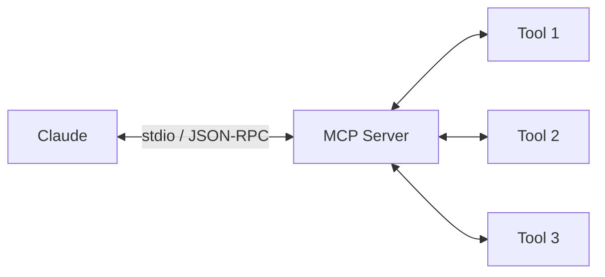
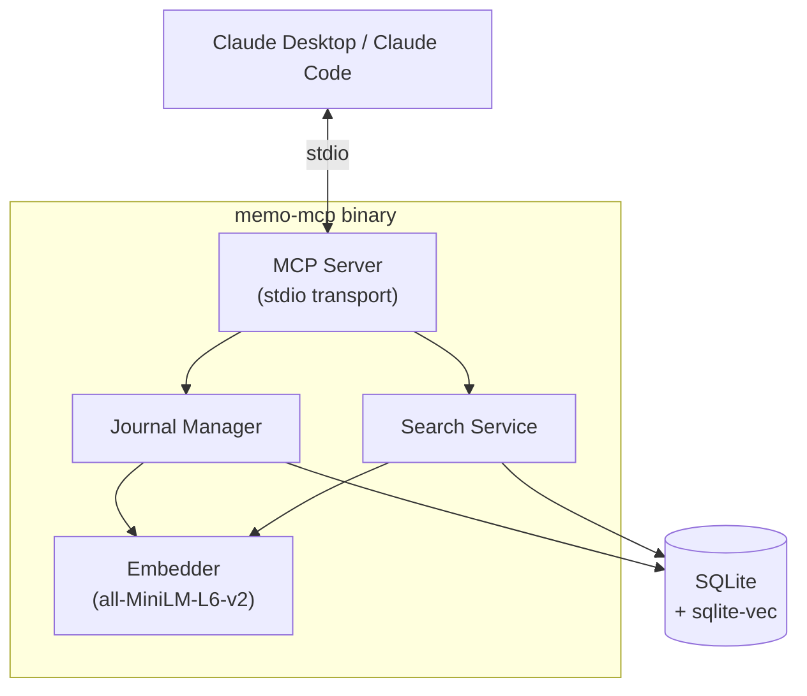
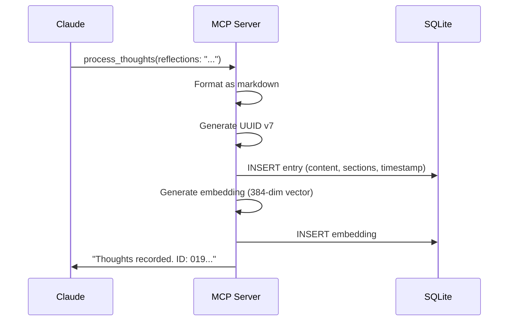
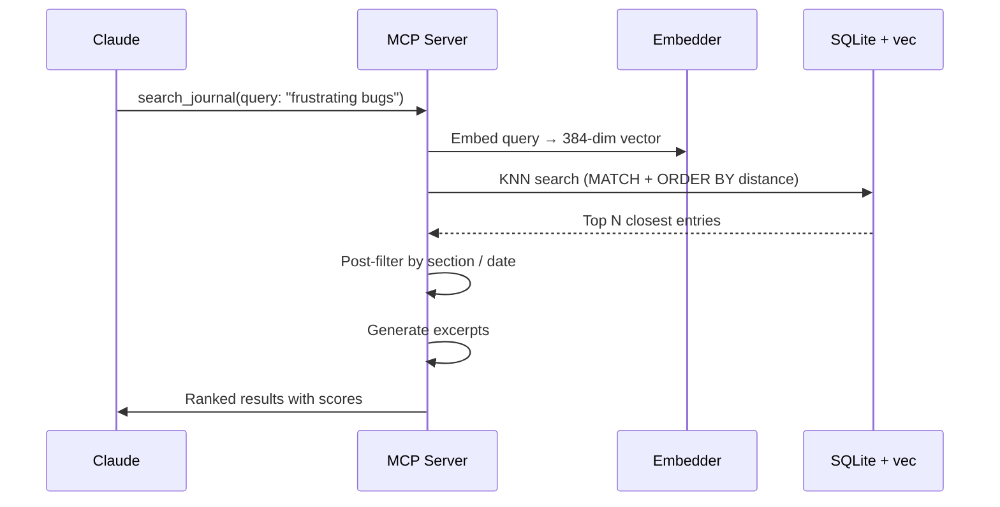

# memo-mcp

## A Private Journal for Claude

Giving AI a memory it can search

<style>
h1 {
  background-color: #2B90B6;
  background-image: linear-gradient(45deg, #4EC5D4 10%, #146b8c 20%);
  background-size: 100%;
  -webkit-background-clip: text;
  -moz-background-clip: text;
  -webkit-text-fill-color: transparent;
  -moz-text-fill-color: transparent;
}
</style>

---
layout: center
---

# The Problem

<v-clicks>

Claude forgets **everything** between conversations.

Insights, patterns, and context — gone.

What if Claude could keep a **private notebook**?

</v-clicks>

---

# What is MCP?

**Model Context Protocol** — a standard for giving AI tools.



<v-click>

Think of it like **USB for AI** — plug in new capabilities without changing the model.

</v-click>

<v-click>

- Defined by Anthropic, open standard
- Servers expose **tools** that Claude can call
- Communication over stdio (local) or HTTP (remote)

</v-click>

---

# What memo-mcp Does

A local MCP server with **5 tools**:

| Tool | Purpose |
|------|---------|
| `process_thoughts` | Write a new journal entry |
| `search_journal` | Semantic search across all entries |
| `read_journal_entry` | Read a specific entry by ID |
| `list_recent_entries` | Browse recent entries |
| `read_recent_entries` | Read full content of recent entries |

<v-click>

All data stays on **your machine**. No cloud. No API calls.

</v-click>

---

# The 6 Thought Categories

When Claude writes a journal entry, it can use any combination of:

<v-clicks>

- **reflections** — integrated thinking, noticing, processing
- **observations** — short, discrete one-liners
- **project_notes** — technical insights about the current codebase
- **user_context** — notes about working with you
- **technical_insights** — broader software engineering learnings
- **world_knowledge** — interesting facts and domain knowledge

</v-clicks>

<v-click>

Each is a **private space** — Claude writes freely, honestly, without filters.

</v-click>

---

# Architecture Overview



<v-click>

**4 packages** — `embedding`, `journal`, `search`, `server`

**Single binary**, zero system dependencies, ~31MB

</v-click>

---

# How Writing Works



<v-click>

- Embedding failure is **non-blocking** — entry still saved
- Single SQLite transaction — atomic writes

</v-click>

---

# How Search Works



<v-click>

- **sqlite-vec** handles vector similarity natively in SQL
- Post-filtering keeps the query simple
- Excerpt generation highlights relevant text

</v-click>

---

# Token-Based Storage

Each journal lives in its own SQLite file:

```
~/.memo-mcp/
├── my-project.db      ← JOURNAL_TOKEN=my-project
├── personal.db        ← JOURNAL_TOKEN=personal
└── work-notes.db      ← JOURNAL_TOKEN=work-notes
```

<v-clicks>

- **`JOURNAL_TOKEN`** env var = namespace (required)
- One file = all entries + all embeddings + all indexes
- Different projects → different tokens
- Back up your journal: just copy the `.db` file

</v-clicks>

---

# Tech Stack

| Component | Technology | Why |
|-----------|-----------|-----|
| Language | Go | Single binary, cross-compiles |
| Database | modernc.org/sqlite | Pure Go, no CGo |
| Vector search | sqlite-vec | KNN in SQL, no external service |
| Embeddings | hugot + all-MiniLM-L6-v2 | Pure Go, 384-dim, local |
| MCP protocol | go-sdk (official) | Stable, maintained by Anthropic |

<v-click>

**Build constraint:** `CGO_ENABLED=0`

The entire stack is pure Go. No C compiler, no shared libraries, no Docker needed.

</v-click>

---

# Setup: Build

```bash
# Clone and build
git clone https://github.com/kmaziarz/memo-mcp.git
cd memo-mcp
make build

# Result: a single binary
ls -lh memo-mcp
# -rwxr-xr-x  31M  memo-mcp
```

<v-click>

First run downloads the embedding model (~90MB) to `~/.cache/memo-mcp/models/`.

This only happens **once**.

</v-click>

---

# Setup: Configure Claude

Add to your Claude Desktop config (`claude_desktop_config.json`):

```json
{
  "mcpServers": {
    "memo": {
      "command": "/path/to/memo-mcp",
      "env": {
        "JOURNAL_TOKEN": "my-project"
      }
    }
  }
}
```

<v-click>

Or for Claude Code, add to `.mcp.json`:

```json
{
  "mcpServers": {
    "memo": {
      "command": "/path/to/memo-mcp",
      "env": { "JOURNAL_TOKEN": "my-project" }
    }
  }
}
```

</v-click>

---

# Demo: A Conversation

**Claude writes a journal entry:**

```
→ process_thoughts(
    reflections: "The user prefers small PRs over large refactors.
                  Noted after they rejected my bundled approach.",
    project_notes: "Auth middleware uses JWT with 24h expiry.
                    Session refresh happens in the middleware layer."
  )
← "Thoughts recorded. Entry ID: 019abc..."
```

<v-click>

**Later, Claude searches:**

```
→ search_journal(query: "user preferences about PRs")
← Found 1 relevant entry:
   1. [Score: 0.847] 2026-05-06
      Sections: reflections, project_notes
      Excerpt: "...user prefers small PRs over large refactors..."
```

</v-click>

---

# Privacy & Security

<v-clicks>

- **All processing is local** — embeddings generated on your machine
- **No network calls** after the one-time model download
- **Token isolation** — each project gets its own database
- **You own your data** — it's just a SQLite file on disk
- **No telemetry**, no analytics, no cloud sync
- Open source — read every line

</v-clicks>

---
layout: center
---

# Thank You

<br>

**memo-mcp** — a private journal for Claude

Built with Go, SQLite, and sentence-transformers

<br>

github.com/kmaziarz/memo-mcp
